<p align="center">
  
</p>

# Cross-Platform Real-Time Co-WIN Vaccine Slot Finder - *We Find Your Shot!*

[![LatestReleaseWindows][release-shield-windows]][release-version-windows-url]
[![LatestReleaseMacOS][release-shield-macos]][release-version-macos-url]
[![LatestReleaseLinux][release-shield-linux]][release-version-linux-url]
[![Downloads][downloads-shield]][downloads-url]
![TotalBookings][total-bookings-shield]
![BookingsToday][bookings-today-shield]
[![Issues][issues-shield]][issues-url]
[![MIT License][license-shield]][license-url]

[release-shield-windows]: https://img.shields.io/badge/Download--Windows-v5.2.2--windows-cyan?style=for-the-badge
[release-version-windows-url]: https://github.com/SRvSaha/CoWinVaccineSlotFinder/releases/download/v5.2.2-windows/CoWinReleasesv5.2.2-windows.zip
[release-shield-macos]: https://img.shields.io/badge/Download--MacOS-v5.2.0--osx-pink?style=for-the-badge
[release-version-macos-url]: https://github.com/SRvSaha/CoWinVaccineSlotFinder/releases/download/v5.2.0-osx/CoWinReleasesv5.2.0-osx.zip
[release-shield-linux]: https://img.shields.io/badge/Download--Linux-v5.2.0--linux-9cf?style=for-the-badge
[release-version-linux-url]: https://github.com/SRvSaha/CoWinVaccineSlotFinder/releases/download/v5.2.0-linux/CoWinReleasesv5.2.0-linux.zip
[downloads-shield]: https://img.shields.io/github/downloads/srvsaha/CoWinVaccineSlotFinder/total.svg?style=for-the-badge&color=lightgreen
[downloads-url]: https://github.com/SRvSaha/CoWinVaccineSlotFinder/releases
[total-bookings-shield]: https://img.shields.io/endpoint?color=blue&style=for-the-badge&url=https://vaccineslotfindertelemetry.azurewebsites.net/api/overallanalytics
[bookings-today-shield]: https://img.shields.io/endpoint?color=violet&style=for-the-badge&url=https://vaccineslotfindertelemetry.azurewebsites.net/api/dailyanalytics
[issues-shield]: https://img.shields.io/github/issues/SRvSaha/CoWinVaccineSlotFinder?style=for-the-badge&color=red
[issues-url]: https://github.com/SRvSaha/CoWinVaccineSlotFinder/issues
[license-shield]: https://img.shields.io/github/license/SRvSaha/CoWinVaccineSlotFinder?style=for-the-badge&color=brown
[license-url]: https://github.com/SRvSaha/CoWinVaccineSlotFinder/blob/master/LICENSE

> _**Watch [Demo](#watch-demo-on-how-to-get-your-slot-in-1-minute) to See How It Works, Check Out [App Statistics](#statistics--footprints---see-the-analytics-from-metadata-of-slot-finder) & Download Latest Version of the Software for your Operating System by clicking the above links or by clicking [here](https://github.com/SRvSaha/CoWinVaccineSlotFinder/releases) & kindly follow the steps mentioned in [How To Use](#for-folks-who-just-want-to-get-shit-done) and read the [FAQs](#faqs)**_

> **NOTE:** _**Please make sure [these changes](#configuration-changes) are done in [Config file `appsettings.json`](#configuration-changes) before running the Software**_

## WATCH DEMO - _How To Get Your Slot Under 60 Seconds_

[Click Here To Play The Demo](https://user-images.githubusercontent.com/13312352/124377961-805dc480-dccc-11eb-9e9a-09964b651368.mp4)

## STATISTICS & FOOTPRINTS - _See the Analytics from metadata of Slot Finder_

*Total Bookings Analysis till Date*

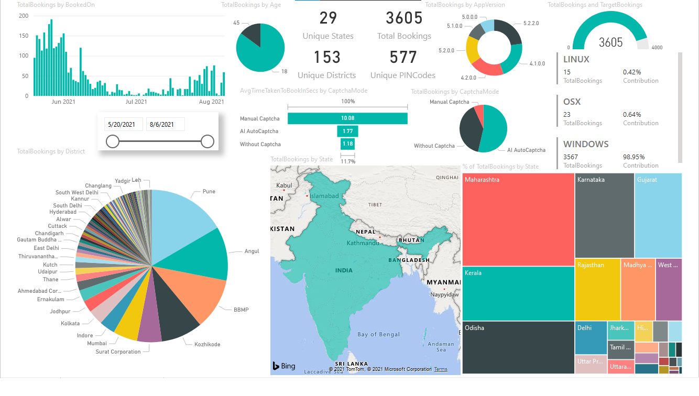

*Total Bookings Analysis for Today*


*Summary of Total Bookings Analysis till Date*

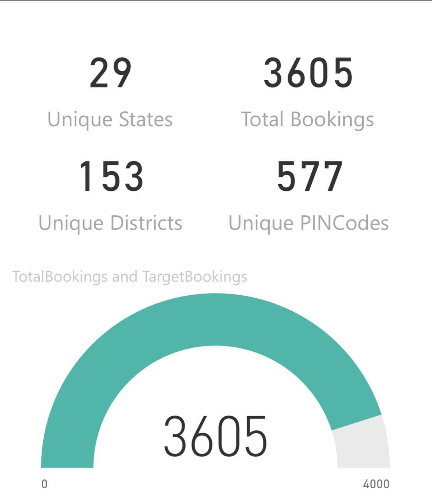

*Summary Total Bookings Analysis for Today*

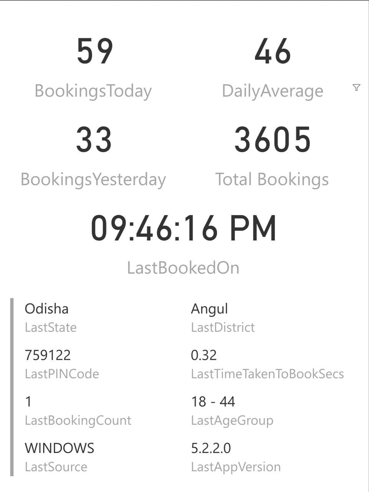

*Overall Bookings from Different Places till Date*


*Bookings Today vs Overall vs Yesterday*

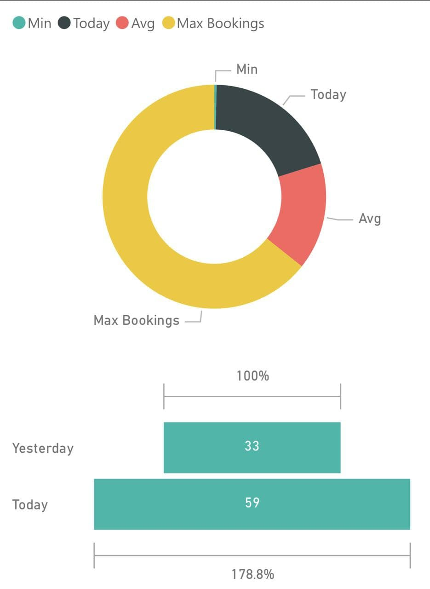

*Total Bookings Based on Age and Platform*

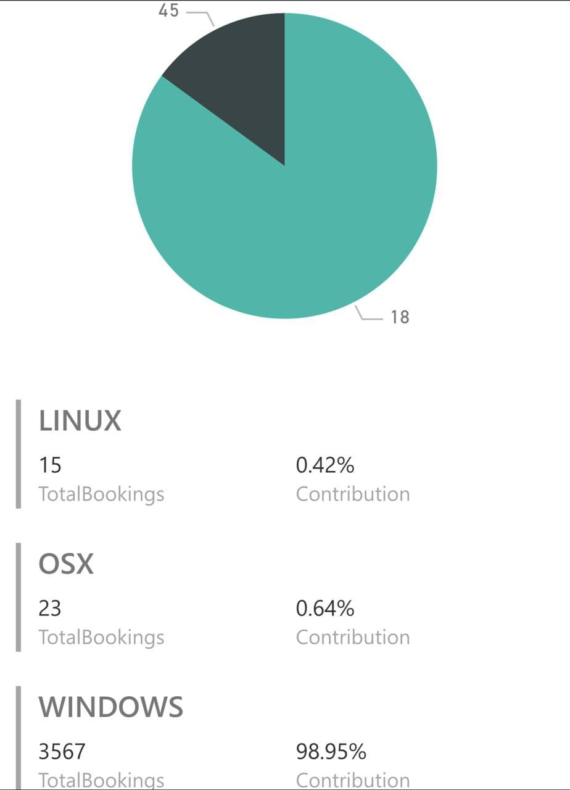

*Total Bookings Trendline and App Version*

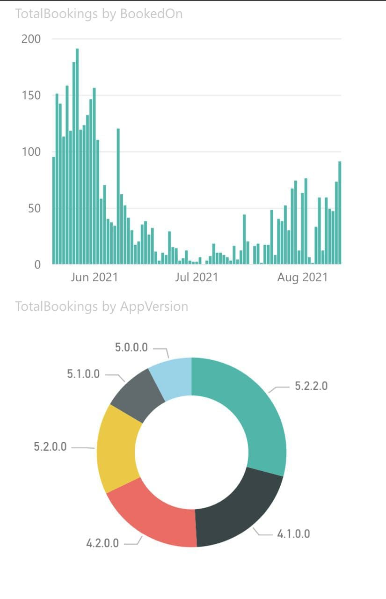


### DISCLAIMER


#### *__DUE TO LATEST CHANGES IN THE API ACCESS POLICY BY [MoHFW](https://www.mohfw.gov.in/pdf/CoWINAPIGuidelinesFinal240521.pdf), THERE WILL BE NO MORE COMMITS/CONTRIBUTIONS/RELEASES/MAINTENANCE IN THE PROJECT. THE PROJECT HAS BEEN PUT ON INDEFINITE HOLD. GRATEFUL TO EVERY CONTRIBUTORS, SUPPORTERS, USERS THAT WE COULD HELP YOU IN THE CRISIS. EVEN THOUGH YOU MAY STILL USE THE APP AFTER GOING THROUGH THE [T&C](https://www.cowin.gov.in/terms-condition), WE ADVISE NOT TO MISUSE IT, OTHERWISE YOU MIGHT FACE LEGAL ISSUES. USE IT AT YOUR OWN RISK__*


> **NOTE:** _Please go through the [Disclaimer](https://github.com/SRvSaha/CoWinVaccineSlotFinder/blob/master/DISCLAIMER.md), [End User Lisence Agreement](https://github.com/SRvSaha/CoWinVaccineSlotFinder/blob/master/EULA.md) & the [Privacy Policy](https://github.com/SRvSaha/CoWinVaccineSlotFinder/blob/master/PRIVACYPOLICY.md), proceed further only if you accept the [Terms and Conditions](https://github.com/SRvSaha/CoWinVaccineSlotFinder/blob/master/T&C.md) to use the Application/Software_


## Important: 
- This is a proof of concept project. I do NOT endorse or encourage or condone, in any shape or form, automating any monitoring/booking tasks. **Developed for Educational Purpose; USE IT AT YOUR OWN RISK. DEVELOPERS SHOULD NOT BE HELD RESPONSIBLE FOR ANY LEGAL CONCERNS.**
- **FURTHER, ANY USE OF THE SCRIPT FOR MONETARY, UNETHICAL, OR ILLEGAL PURPOSES IS NOT PERMITTED. - IN CASE, YOU ARE FOUND TO DO THE SAME, YOU SHALL BE SOLELY LIABLE FOR THE CONSEQUENCES. THE DEVELOPER SHALL AND CANNOT BE HELD LIABLE FOR THE UNETHICAL OR ILLEGAL USE OF THE SAME**
- _This goes without saying but, once you get your shot, please do help out any underprivileged people around you who may not have a laptop or the know-how. For instance any sort of domestic help, or the staff in your local grocery store, or literally the thousands of people who don't have the knowledge or luxury we do._
- Do NOT use unless all the beneficiaries selected are supposed to get the same vaccine and dose. 
- When multiple beneficiaries are added for a single registered mobile number, all beneficiaries will get the Same Dose, Same Vaccine, Same Centre and Same Slot. In case any of this doesn't meet the requirements, booking might not be successful. 
- While selecting beneficiaries, make sure that selected beneficiaries are all taking the same dose: either first OR second.
  Please do no try to club together booking for first dose for one beneficiary and second dose for another beneficiary.
- While selecting beneficiaries, also make sure that beneficiaries selected for second dose are all taking the same vaccine: COVISHIELD OR COVAXIN OR SPUTNIK V.
  Please do no try to club together booking for beneficiary taking COVISHIELD with beneficiary taking COVAXIN.
- If you're selecting multiple beneficiaries, make sure all are of the same age group (45+ or 18+) as defined by the govt.
  Please do not try to club together booking for younger and older beneficiaries.
- AUTO BOOKING is ON by default, so it books the slot by searching by PIN Code/District for the particular Vaccination Centre(s) or even by the Names of the Vaccination Centres within the PINCode. 
- If you accidentally book a slot, don't worry. You can always login to the [Official portal](https://selfregistration.cowin.gov.in/) and cancel or re-schedule the booking. There is no option for reschedule or cancel of Booking of Slot available in the Application. There will be an X symbol on the right-top corner for each beneficiary to cancel from CoWIN Portal.
- There is no option to register new mobile or add beneficiaries. This can be used only after beneficiary has been added through the Official WebApp of [CoWIN](https://cowin.gov.in/).
- Application has been developed solely for the purpose of helping needy people book their vaccination slots by way of automation.
- The Application, a public use free software, assists you in a comprehensive screening of available slots and booking the same for you. **IT DOES NOT GUARANTEE A SLOT**. Only if a slot is available as per your preference, will the slot be booked.
- The Developer reserves their rights to take any legal action as enumerated under the law against any unethical or illegal use of the same.

## Glimpse of the Application:

*Application With Bare Miminum Configuration Changes*


*Application Start - Software Update Notifier*

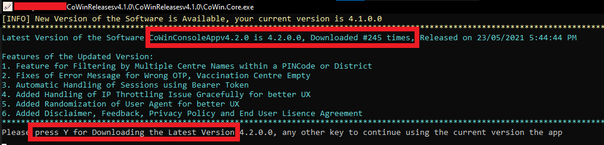

*Application Start - Disclaimer, End-User Lisence Agreement, T&C, Privacy Policy Agreement Consent*

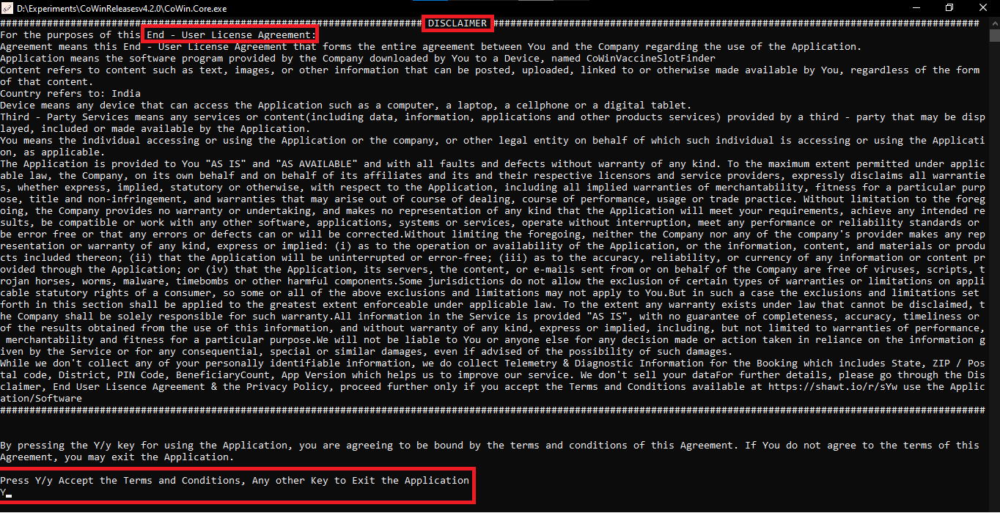

*Application Start - OTP Generation*


*Application Start - OTP Validated - BearerToken Generation*


*Application Start - OTP Validated - Invalid BearerToken provided in Config; Regeneration Session by Resending OTP*


*Application Start - Invalid OTP  Entered. Re-Generating new OTP*

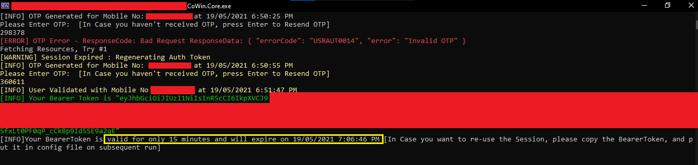

*Application OTP Retrigger In Case OTP is not received within time. Press `Enter` to Retrigger OTP*


*Successful Booking Scenario - With AI-Auto Captcha*

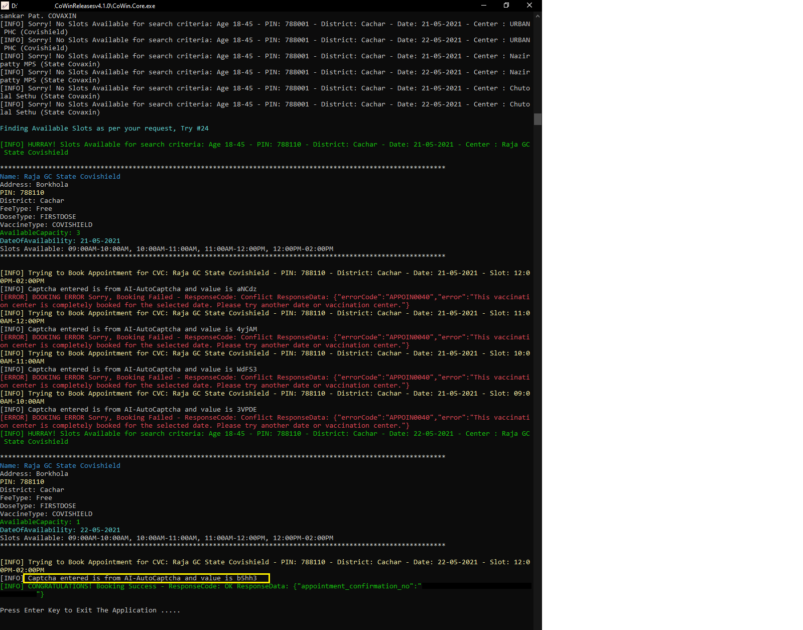

*Successful Booking Scenario - Showing Support & Sharing Word of Mouth*

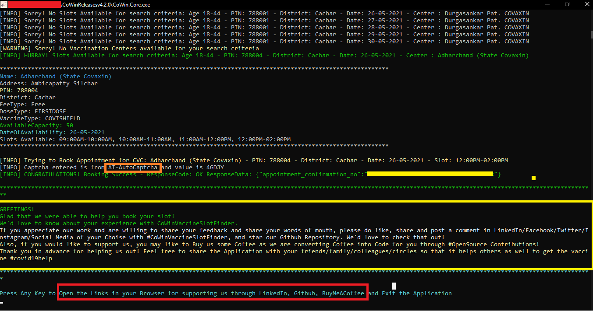

*Unsuccessful Booking - All Slots Full*


*Unsuccessful Booking - Server Under Heavy Load*


*Application Session Regeneration on TimeOut* 


*Application OTP Validity Expired (`Expiry Time 3 Minutes from Generation`) when user enter the OTP for validation*


## Application Features

Following are some of the main features of the App:

- [x] OTP Generation/Validation
- [x] Search by Either PINCode or District or Both PINCode and District with preference to PINCode for better Searching
- [x] Search for Slots only for Particular Centres by CentreName within PINCode/District
- [x] Auto Retry To Fetch Slots by Dynamically computing IP Throttling Limit
- [x] BEEP BEEP User Notifier On IP Throlling To Notify User regarding Too Many Requests
- [x] OTP Notifier for New Session & On Timeout
- [x] Booking for Multiple Beneficiaries linked to a Registered Mobile Number 
- [x] OTP Regeneration/Validation on Timeout/Session Expiry 
- [x] Zero Setup Application, Just Download and Run! Easy to Use!
- [x] No specialized Software required for modification of Config file
- [x] Allow Any Vaccine Type and Any Fee Type for Booking Slots
- [x] Application Latest Version Check Automatically before proceeding
- [x] Verbose Mode so that user can check each and every step as what is going on behind the scenes when slots are being fetched & processed
- [x] Telemetry Metadata of Booking for Updating Statistics to see how the App is helping others. No Personal Information to be taken.
- [x] Integration of Notification Engine with Telegram Bot
- [x] Native Cross-Platform Support for Windows/Mac/Linux
- [x] Automatically handling IP Throttling Issue with fixed Refresh Threshold. 
- [x] Automatically Download Appointment Slip on Successful Booking of Slot
- [x] Feature to Choose Slot Preference for Auto-Booking
 
## Technical Details

It's a simple hybrid Console Application being developed using .NET Core 3.1, WinForms and C#.

_**Currently, application is bundled as a Single Standalone Executable file with Runtime included and therefore no installations are needed to run the Application. Application can be used in Windows/Linux/Mac without any external dependencies**_

In General, to run the application, the following things are needed:
- [x] **WINDOWS**: Windows 7 SP2 or higher where .NET Core 3.1 Runtime is supported, that's it. 
- [x] **LINUX**: 64-bit Debian like Distros eg. Ubuntu, Mint, Kali Linux etc are supported with support for .NET Core 3.1 Runtime
- [x] **MACOSX**: 64-bit Mac OSX (Version 10.13 and above) is supported with .NET Core 3.1 Runtime

> [.NET Core 3.1 Runtime](https://dotnet.microsoft.com/download/dotnet/3.1/runtime) is bundled in the Release so no other external dependencies to run the Application.
  _FOR DEVELOPERS TO BUILD/MODIFY_ [.NET Core 3.1 SDK](https://dotnet.microsoft.com/download/dotnet/thank-you/sdk-3.1.408-windows-x64-installer) is required to build from Source Code or to make some customizations. Use of [Visual Studio 2019](https://visualstudio.microsoft.com/downloads/) is recommended for the purpose of development. 

Currently, searching using the [findByDistrict API](https://apisetu.gov.in/public/marketplace/api/cowin/cowin-public-v2#/Appointment%20Availability%20APIs/findByDistrict) and [findByPin API](https://apisetu.gov.in/public/marketplace/api/cowin/cowin-public-v2#/Appointment%20Availability%20APIs/findByPin) are integrated to get all the available slots in a particular district/PINCode.
 
There is API throttling (Rate-Limiting) of 100 requests/5 minutes from 1 IP Address. Application heuristically switches automatically to circumvent the issue for finding slot.

## How to Use:

### For Folks who just want to get shit done

### For Windows Users: 

- Get the Latest Release of the Software either by [clicking here](https://github.com/SRvSaha/CoWinVaccineSlotFinder/releases) or from Releases Section of Github
- Download the ZIP file of the Latest release for your Operating System [OS Name is suffix in the Release Version Name eg. CoWinReleasesv5.2.2-windows.zip]
- Extract the ZIP file, you'll find two file like this:
  
 
 
- Modify the settings inside `appsettings.json`
- Double Click `CoWinVaccineSlotFinder.exe` to RUN the Application.

### How to run on macOS/Linux Systems : 

- Get the Latest Mac Release either by [clicking here](https://github.com/SRvSaha/CoWinVaccineSlotFinder/releases/tag/v5.2.0-osx) or from Releases Section of Github

- Get the Latest Linux Release either by [clicking here](https://github.com/SRvSaha/CoWinVaccineSlotFinder/releases/tag/v5.2.0-linux) or from Releases Section of Github

- Download the ZIP file of the Latest Release for your Operating System [OS Name is suffix in the Release Version Name eg. CoWinReleasesv5.2.0-osx.zip or CoWinReleasesv5.2.0-linux.zip]

- Extract the ZIP file

- Modify the settings inside `appsettings.json` as mentioned below.

- Go the the downloaded folder for eg : `Users/xyz/Downloads/CoWinReleases/`

- To run the executable file open  `terminal` of your choice in the Downloaded Folder Path

- Run the command ```bash run.sh``` in the Terminal to Start the App

### Troubleshooting macOS Problems :

- While downloading, after download is complete in the browser, it might show you that the downloaded file might contain viruses. There'll be an option to Discard or to Keep. You must keep it.

- If an error pops up like : `Application can't be opened because it is from an unidentified developer.`

- Go to **System Preferences -> Secuity & Privacy -> Allow apps downloaded from:** `Select App Store and identified developers`

- Even after Allowing the App downloaded from Identified Developer, you might need to explicity allow `CoWinVaccineSlotFinder` from the above option

- In case it asks your permission to `Open/Move To Bin` for the Application as it is not downloaded from AppStore, use Open otherwise it won't run

### How to Open appsettings.json

In layman terms, it is just like any other text file which can be opened in any text editor like Notepad, Wordpad, VS Code, Sublime Text, Notepad++ etc.
Modification can be done and file to be saved again with the same name and File Types as "All Files"

### How to Get User Specific Information for appsettings.json

1. Go to `cowin.gov.in`
2. Generate OTP for your registered mobile number. You need to provide this mobile number in the `appsettings.json` file.
3. Validate the OTP
4. After you are logged in, you'll see a dashboard like this, get the highlighted number REF ID, which is your beneficary ID and would be required in your `appsettings.json`. If you have multiple members added in your registered mobile number, you will get multiple REF IDs. Use the REF IDs for which you want to do booking

  

5. Also, Once all these details are fetched, put them in the `appsettings.json`. 
6. Run the Application CoWinVaccineSlotFinder.EXE, that's it.

> You may also see a file with the name `authToken.json` in your directory when you are running the Application. This is done so that your session information is stored locally in your device and you don't need to enter OTP manually until 15 minutes, in case you close the Application and run again, it will resume with your previous session. That is possible because of your data stored in this `authToken.json` file. However, that being said this doesn't mean that you don't have to enter OTP. You still have the dependency of entering OTP in the Application, just that if you have to close the Application due to IP Throttling or some other issue, you can resume if your Token is still valid without waiting for a new OTP.

## Configuration Changes

### _**The values of the following items MUST BE MODIFIED in `appsettings.json`**_

``` javascript
"BeneficiaryIds": [ "REPLACE_WITH_YOUR_BENEFICIARY_ID_1", "REPLACE_WITH_YOUR_BENEFICIARY_ID_2" ] 
// You'll get the beneficiary ID from Step 4 above. 
// If you have only 1 beneficiary ID then Use it in the <REPLACE_WITH_YOUR_BENEFICIARY_ID_1> section and remove rest like "REPLACE_WITH_YOUR_BENEFICIARY_ID_2" eg. ["1111111111111111"]. 
// If you have multiple beneficiaries for which you want to do booking, added them comma separated eg. ["11111111111111", "22222222222222", "33333333333333"]
"Mobile": "REPLACE_WITH_YOUR_REGISTERED_MOBILE_NO", 
// Use your registered mobile number used for generation of OTP in Step 2 above.
// Use it in the REPLACE_WITH_YOUR_REGISTERED_MOBILE_NO section. Suppose your Mobile Number is 8888333388 then it'll be like "Mobile" : "8888333388". 
// *NOTE* Don't use +91 infront of your mobile number, use only 10 digit mobile number
"DoseType":  "<REPLACE_ME>", // Use either 1 OR 2 Depending on 1st DOSE or 2nd DOSE in the <REPLACE_ME> section, by default 1 is selected for 1st Dose
"PINCodes": [
  "REPLACE_ME_WITH_YOUR_PIN_CODE_1",
  "REPLACE_ME_WITH_YOUR_PIN_CODE_2"
]
// You can use multiple PINCodes for which you wish to search for, examples are of Mumbai and nearby areas. 
// If you want to search say for a particular PIN Code of Mumbai let's say 400008 then the entry would look like this : "PINCodes": [ "400008" ].
// Basically, Replace REPLACE_ME_WITH_YOUR_PIN_CODE_1 WITH 400008. and remove everything else.
// In case you want to search for multiple PIN Codes say 400008 and 400007, 
// you'll have to remove REPLACE_ME_WITH_YOUR_PIN_CODE_1 with 400008 and REPLACE_ME_WITH_YOUR_PIN_CODE_2 with 40007 and so in, it would look something like this "PINCodes": [ "400008", "400007" ]

```

### _**The values of the following items MAY BE MODIFIED in `appsettings.json`, default values are set**_
Please Note: DO NOT Change or remove to Defaut values if you are not going to use the setting for your Searching of Slot. 

``` javascript
"MinAgeLimit": "<REPLACE_ME>", // Use either 18 or 45 in the REPLACE_ME Section. 18 means that you are searching for slots of 18+ and 45 means for 45+. By default, 18 is used.
"MaxAgeLimit": "<REPLACE_ME>", // Use either 44 or 99 in the REPLACE_ME Section. 44 means that you are searching for slots of only 18+ (18-44) Age Group and 100 means that you are searching for only 45+ (45-99) age group. By default, 44 is used.
"MinimumVaccineAvailability": "<REPLACE_ME>", // Use 1 or any Minumum Number that you feel should be available atleast when you are searching for slots, in the REPLACE_ME section. By default, 1 is selected as minimum availability
"ProtectedAPI": { "IsToBeUsed": "<REPLACE_ME>"} // Use true of false in the <REPLACE_ME> section. Use false if you want to search slots using Public API. By default, true to use ProtectedAPI for searching
"VaccineType": "<REPLACE_ME>", // USE EITHER COVAXIN OR COVISHIELD, OR SPUTNIK V or "" in the <REPLACE_ME> section, by default "" is selected with means any type of Vaccine
"VaccineFeeType": "<REPLACE_ME>", // USE Either Free or Paid or "" in the <REPLACE_ME> section, by default "Free" is selected, blank implies both Free and Paid types
"SlotPreference": "<REPLACE_ME>", // Preference of Slot of Booking, use either First or Last or Random in the <REPLACE_ME> section; Default is Last (due to higher changes of getting the slot)  
"IsSearchToBeDoneForVaccinationCentreName": "<REPLACE_ME>", // se Either true or false in the <REPLACE_ME> section where true means you want to search for specific Centres within your PINCode/District and false means you don't want to search by CentreName. By default, false is selected
"VaccinationCentreNames": [
    "REPLACE_ME_WITH_YOUR_VACCINATION_CENTER_NAME_1",
    "REPLACE_ME_WITH_YOUR_VACCINATION_CENTER_NAME_2"
], // You need to put the exact names of the Vaccination Centres for which you want to search in the REPLACE_ME_WITH_YOUR_VACCINATION_CENTER_NAME_1, REPLACE_ME_WITH_YOUR_VACCINATION_CENTER_NAME_2 sections.
// You'll get the names of the Centres from CoWIN Portal. By default all Vaccination Centres in the District/PINCodes are selected. Filter will work only if you set the IsSearchToBeDoneForVaccinationCentreName to true and provide proper exact names of the Centres for which you are searching slots
"IsSearchToBeDoneByPINCode": "<REPLACE_ME>", // Use Either true or false in the <REPLACE_ME> section where True means searching is done using PIN Code, by default true is selected. Set this is True if you want to search By PIN Code
"DateToSearch": "<REPLACE_ME>",  // Use date in DD-MM-YYYY Format in the <REPLACE_ME> section, Blank implies date of next day (i.e, tomorrow), by default "" is selected to search for Next Day
"IsSearchToBeDoneByDistrict": "<REPLACE_ME>", // Use Either true or false in the <REPLACE_ME> section where True means searching is done by DistrictId, by default false is selected, Set this is True if you want to search By District
"Districts": [
  "REPLACE_ME_WITH_YOUR_DISTRICT_CODE_1",
  "REPLACE_ME_WITH_YOUR_DISTRICT_CODE_2"
],
// You'll get District Codes from the link below this block, examples are for Mumbai and nearby districts. 
// Basically, Replace REPLACE_ME_WITH_YOUR_DISTRICT_CODE_1 with 395, then the entry would look like this : "Districts": [ "395" ].
// In case you want to search for multiple Districts say Mumbai and Thane, get the District-District Code Mapping from below "State-District-DistrictCode Mapping", // you'll get the DistrictCode of Mumbai as 395 and of Thane as 392.
// You'll have to remove REPLACE_ME_WITH_YOUR_DISTRICT_CODE_1 with 395 and REPLACE_ME_WITH_YOUR_DISTRICT_CODE_2 with 392, it would look something like this "Districts": [ "395", "392"]
"SleepIntervalInMilliseconds": "<REPLACE_ME>", // In the <REPLACE_ME> Section, Use the Time Interval in Milliseconds you want the system to take rest after trying out your Search Criteria of PIN/District/CentreName once. This will help in lessening the chances of getting IP Throttled. Default is 3500
"IsThrottlingToBeUsed": "<REPLACE_ME>", // In the <REPLACE_ME> Section, Use either true or false; By default true; True means IP throttling is there, False means IP throttling has been removed
"ThrottlingThreshold": "<REPLACE_ME>", //In the <REPLACE_ME> Section, Use the Number of requests per IP allowed for ThrottlingInterval. By default it is set to 100
// Say Throttling Interval is 5 minutes and ThrottlingThreshold is 100, that means, you are allowed for 20 Hits from your IP Address per minute. 
// Change these values accordingly whenever you face the issue of IP being throlled by Server. 
// You may even switch to a different network/IP/Proxy Server so that this can remove the IP Throttling issue for you
"ThrottlingIntervalInMinutes": "<REPLACE_ME>", // In the <REPLACE_ME> Section, use the Interval of Time that is being set for throttling of IP Address. By Default it is // set to 5 which means 5 minutes i.e, in Interval of 5 minutes, 100 requests from your IP Address/Software is allowed. After that you'll receive error unless you switch to another network.
"ThrottlingRefreshTimeInSeconds": "<REPLACE_ME>", // In the <REPLACE_ME> Section, use the Interval of Waiting Time in Seconds when IP is throttled, before resuming the application again. 
// By default, 5 seconds is set as the Refresh Time
// Set the value Higher if you want more wait time when you IP is throttled, or Lower if you are in hurry to book (with chances of getting IP throttled more frequently) 
"Proxy": 
{
   "IsToBeUsed": "<REPLACE_ME>", // Use true or false, true if you are behind Proxy Server, false if you're not, in the <REPLACE_ME> section, by default false would be selected
   "Address": "<REPLACE_ME>" // Use the THE PROXY ADDRESS IF YOU ARE BEHIND PROXY SERVER (usually in Office/Corporate Network) in the <REPLACE_ME> Section, by default this will be blank
}
```

*You can get the District Name and District Code Mapping from [State-District-DistrictCode Mapping](data/resources/State_District_DistrictCode_Mapping.json). Just copy the values of the `DistrictCode` from the file and paste it in the `appsettings.json` file's {"Districts"}* Or, you can refer the readable [State-District-DistrictCode Markdown](data/resources/State_District_DistrictCode_Mapping.md) file and get the values of District Codes from there.

Entries in the [State-District-DistrictCode Mapping](data/resources/State_District_DistrictCode_Mapping.json) file would be like below. In this case, the DistrictCode will 3, 1 and 2.

```javascript 
  "Andaman and Nicobar Islands": {
    "Nicobar": 3,
    "North and Middle Andaman": 1,
    "South Andaman": 2
  }
``` 

Be default, this is how the `appsettings.json` would look like this:
``` javascript
{
  "CoWinAPI": {
    "PublicAPI": {
      "FetchByDistrictUrl": "https://cdn-api.co-vin.in/api/v2/appointment/sessions/public/findByDistrict",
      "FetchByPINUrl": "https://cdn-api.co-vin.in/api/v2/appointment/sessions/public/findByPin"
    },
    "ProtectedAPI": {
      "IsToBeUsed": true, // Set this to false if you want to search slots using Public API
      "FetchByDistrictUrl": "https://cdn-api.co-vin.in/api/v2/appointment/sessions/findByDistrict",
      "FetchByPINUrl": "https://cdn-api.co-vin.in/api/v2/appointment/sessions/findByPin",
      "ScheduleAppointmentUrl": "https://cdn-api.co-vin.in/api/v2/appointment/schedule",
      "AppointmentSlipUrl": "https://cdn-api.co-vin.in/api/v2/appointment/appointmentslip/download",
      "BeneficiaryIds": [ "REPLACE_WITH_YOUR_BENEFICIARY_ID_1", "REPLACE_WITH_YOUR_BENEFICIARY_ID_2" ]
    },
    "Auth": {
      "IsToBeUsed": true,
      "OTPGeneratorUrl": "https://cdn-api.co-vin.in/api/v2/auth/generateMobileOTP",
      "OTPValidatorUrl": "https://cdn-api.co-vin.in/api/v2/auth/validateMobileOtp",
      "Secret": "U2FsdGVkX18vDwDor+oOIG7vSUnINtlc/pxQcNiBulCm8LT5Sza+aIISKLqImbpMnRYgsN2QACPhggLWgZEpQg==",
      "Mobile": "REPLACE_WITH_YOUR_REGISTERED_MOBILE_NO"
    },
    "SleepIntervalInMilliseconds": 3500,
    "IsThrottlingToBeUsed": true, // Use either true or false; By default true; True means IP throttling is inplace, False means IP throttling has been removed
    "ThrottlingThreshold": 100, //Number of request per IP allowed for ThrottlingInterval
    "ThrottlingIntervalInMinutes": 5,
    "ThrottlingRefreshTimeInSeconds": 5, // Waiting Time when IP is throttled, before resuming the application again. Set the value Higher if you want more wait time when you IP is throttled, or Lower if you are in hurry to book (with chances of getting IP throttled more frequently)
    "TotalIterations": 10000,
    "SelfRegistrationPortal": "https://selfregistration.cowin.gov.in",
    "MinAgeLimit": 18,
    "MaxAgeLimit": 44,
    "MinimumVaccineAvailability": 1,
    "VaccineType": "", // Blank Implies Any VaccineType: COVISHIELD OR COVAXIN OR SPUTNIK V; Default is any type of Vaccine
    "DoseType": 1,
    "VaccineFeeType": "Free", // Blank Implies Any VaccineFeeType: Free or Paid; Default is Free    
    "SlotPreference": "Last", // Preference of Slot of Booking, use either First or Last or Random; Default is Last (due to higher changes of getting the slot)  
    "IsSearchToBeDoneForVaccinationCentreName": false, // Set this is true if you want to search for specific Centres within your PINCode/District
    "VaccinationCentreNames": [ // Don't change me if you are not setting IsSearchToBeDoneForVaccinationCentreName as true
      "REPLACE_ME_WITH_YOUR_VACCINATION_CENTER_NAME_1",
      "REPLACE_ME_WITH_YOUR_VACCINATION_CENTER_NAME_2"
    ], // You need to put the exact names of the Vaccination Centres for which you want to search. You'll get that from CoWIN Portal
    "IsSearchToBeDoneByPINCode": true, // Set this as true if you want to set by PINCode
    "PINCodes": [
      "REPLACE_ME_WITH_YOUR_PIN_CODE_1",
      "REPLACE_ME_WITH_YOUR_PIN_CODE_2"
    ],
    "IsSearchToBeDoneByDistrict": false, // Set this is true if you want to search By District
    "Districts": [ // Don't change me if you are not setting IsSearchToBeDoneByDistrict as true
      "REPLACE_ME_WITH_YOUR_DISTRICT_CODE_1",
      "REPLACE_ME_WITH_YOUR_DISTRICT_CODE_2"
    ],
    "DateToSearch": "" // DD-MM-YYYY Format, Blank implies tomorrow's day; Slots are searched ONLY FOR THE DATE in DateToSearch
  },
  "Proxy": {
    "IsToBeUsed": "false",
    "Address": ""
  }
}

```

As simple as that!

Enjoy and feel free to Star the Repo, if it could help you in any way!

### For Developers or Curious Minds:

If you have Visual Studio installed, go ahead an Clone the Repository, Open the SLN file, Make changes in  `appsettings.json`, Ctrl + F5 and Boom!
It will do the searching for you, your booking will get done but your booking notifications won't work and you'll get `System.IO.InvalidDataException` exception. Reason for this is that Telemetry and Notification Module needs an Base64 encoded Encrypted Endpoint, API Key and Secret. Since it's not a good practice to HardCode it in Source Code, so it won't work unless you get the Encrypted API Endpoint, Telegram Bot Auth Token and the Secret Key along with similar API Endpoint and Secret Key for Telemetry.
Unless you care about these, you can proceed, everything will work just fine! 

> Still curious about that, check out [Telemetry](https://github.com/SRvSaha/CoWinVaccineSlotFinder/blob/master/CoWin.Core/Models/Telemetry.cs) and [TelegramBotModel](https://github.com/SRvSaha/CoWinVaccineSlotFinder/blob/master/CoWin.Core/Models/TelegramBotModel.cs)

However the standalone release for Windows/Linux/MacOS has all these dependencies buldled so you don't need to worry about anything! Everything will work seamlessly, we got your back!

Well, want to dig deeper?

So basically, you've this Project Named `CoWin.Core` which contains `appsettings.json` which performs most of the magic.
~~`CoWin.UI` is just a small project for handling the Captcha.~~ `CoWin.Tests` is used for Automated Unit Tests.

Rest of the Business Logic are there inside the  `/Models` directory. Authentication & Authorization stuffs can be found in `/Auth` directory. API consumption stuffs can be found in `/Providers` directory.
Application begins from `Program.cs` from the `CoWin.Core` project.

> Clean Coding Practices have been followed during the development of the Application within a span of 2 days after Office Hours. So, you won't find proper Exception Handling, using Dependency Injection or Logging or even Documentation, duh!

I know, I know, it's unacceptable, but folks, it's all about quick Time to Market first and then doing one thing at a time, to improve the product. 

I'll be more than happy to have PRs with modifications.

If you'd like to do it the hard way, clone it, build it and run it. Make sure you've the dependencies required to run the Application as mentioned in [Technical Details Section](#technical-details)

## FAQs

- What should be the Configuration Changes if I want to book for 18 & Above Category (which includes 45+ as well)
> `Configuration Should Be "MinAgeLimit": 18, "MaxAgeLimit": 100 in appSettings.json`
- What should be the Configuration Changes if I want to book for 18-44 age group (which includes only 18 to 44 Age)
> `Configuration Should Be "MinAgeLimit": 18, "MaxAgeLimit": 44 in appSettings.json`
- What should be the Configuration Changes if I want to book for 45 & Above age group (which includes only specificially for 45+)
> `Configuration Should Be "MinAgeLimit": 45, "MaxAgeLimit": 100 in appSettings.json`
- What should be the Configuration Changes if I want to First Dose ?
> `Configuration Should Be "DoseType": 1`
- What should be the Configuration Changes if I want to Second Dose ?
> `Configuration Should Be "DoseType": 2`
- What should be the Configuration Changes if I want to Book Specific Vaccine Type ?
> `Configuration Should Be "VaccineType": "COVISHEILD" if you want to get Covishield, "VaccineType": "COVAXIN" if you want to get Covaxin, "VaccineType": "SPUTNIK V" if you want to get SPUTNIK V` 
- What should be the Configuration Changes if I want to Book Slot for Today ?
> `By Default, the Application books slot for the Next Day on which searching is done. To book for taday, you need to use the date of today in "DateToSearch". Let's say today is 8th July 2021 and you want to book slot for today. Configuration Should Be "DateToSearch": "08-07-2021". By default, "DateToSearch" : "09-07-2021" will be used for searching slot, i.e, for next day` 


Cheers!

> **NB:** appsettings.json play the major role for accessing and booking and filtration of searches. Fiddle with it! Appologies that the Code doesn't have inline documentation, but code is readable and self explanatory. In case of any suggestions or bugs or feature request, feel free to raise an Issue.

> Contact us for any further queries or bug report by mailing us at [Vaccine Slot Finder](mailto:vaccineslotfinder@outlook.com?subject=[GitHub]%20README%20VaccineSlotFinder)
