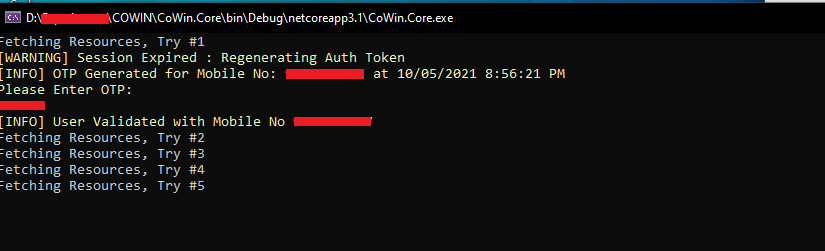

# Vaccine Slot Finder

Console app to fetch the available slots & book the appointment schedule for COVID-19 Vaccination using the publicly available [APISetu APIs](https://apisetu.gov.in/public/marketplace/api/cowin/cowin-public-v2#/) from Govt Of India. 

 


FYI, these APIs are being directly used from the WebApp of [CoWIN](https://cowin.gov.in/) and [Aarogya Setu](https://www.aarogyasetu.gov.in/)

### Glimpse of the Application:

*Application Start*:


 
*Application Slot Booking*
 

 
*Successful Booking Scenario*


*Unsuccessful Booking - All Slots Full*


*Unsuccessful Booking - Server Under Heavy Load*


*Application Session Regeneration on TimeOut* 



#### PRO TIP

> *When the Captcha pops up in the process of booking, you can start typing it immediately as the app would remain ready to accept your input. Once captcha is entered, press Tab to go to the Submit Button and then press Enter to submit. This way, it is faster than operating via Mouse, as every second matters!*

Enjoy and feel free to Star the Repo, if it could help you in any way! Also, feel free to share screenshot (after hiding personal information) as a New Pull Request in the /data/ folder in case you could successfully book through the App. Also share your feedback through issues or just comment/share/like in the associated [LinkedIn Post](https://www.linkedin.com/feed/update/urn:li:activity:6796093424492720128/). That'll be used as References/Testimonials in the Application and will increase the credibility of the App

### DISCLAIMER

### Important: 
- This is a proof of concept project. I do NOT endorse or condone, in any shape or form, automating any monitoring/booking tasks. **Developed for Educational Purpose; Use at your own risk. I SHOULD NOT BE DEEMED RESPONSIBLE FOR ANY LEGAL CONCERNS.**
- This CANNOT book slots automatically. It doesn't skip any of the steps that a normal user would have to take on the official portal. You will still have to enter the OTP and Captcha. This just helps to do it from Console rather than through Official WebApps/Apps.
- Do NOT use unless all the beneficiaries selected are supposed to get the same vaccine and dose. 
- When multiple beneficiaries are added for a single registered mobile number, all beneficiaries will get the Same Dose, Same Vaccine, Same Centre and Same Slot. In case any of this doesn't meet the requirements, booking might not be successful. 
- AUTO BOOKING is ON by default, so it books the slot after you enter a valid captcha for the Slot which is displayed. So, if you feel you want some particular vaccination centre(s), make sure you are searching by PIN Code for the particular Vaccination Centre(s). In case, you don't want to book the slot, you might simply close the Captcha Popup, and the App will try further to book the next available slots in First-Come-First-Serve Basis.

## Application Features

Following are some of the main features of the App:

- [x] OTP Generation/Validation
- [x] Search by Either PINCode or District
- [x] Auto Retry To Fetch Slots Every 2 Seconds
- [x] BEEP BEEP User Notifier On Slot Availability To Book the Available Slot
- [x] Captcha Popup Entry for Booking Slot
- [x] Booking for Multiple Beneficiaries linked to a Registered Mobile Number 
- [x] OTP Regeneration/Validation on Timeout/Session Expiry 
- [x] Zero Setup Application, Just Download and Run! Easy to Use!
- [x] No specialized Software required for modification of Config file
- [ ] Allow Any Vaccine Type and Any Fee Type for Booking Slots; Remove Mandatory Filters on VaccineType and FeeType
- [ ] Integration of Notification Engine with Telegram Bot
- [ ] Integration of Notification Engine with Mail Service
- [ ] Integration of Notification Engine with Mobile Push notification example by using IFTTT Service 
- [ ] Telemerry Metadata of Booking for Updating Statistics to see how the App is helping others. No Personal Information to be taken.
 
## Technical Details

It's a simple Cross-Platform Console Application being developed using .NET Core 3.1, WinForms and C#.

*_Currently, application is bundled as Single Executable EXE with Runtime included. However, it will only work on Windows Machines now_*

In General, to run the application, the following things are needed:
- Windows 7 SP2 or higher where .NET Core 3.1 Runtime is supported
- [.NET Core 3.1 Runtime](https://dotnet.microsoft.com/download/dotnet/3.1/runtime)
- *FOR DEVELOPERS TO BUILD/MODIFY* [.NET Core 3.1 SDK](https://dotnet.microsoft.com/download/dotnet/thank-you/sdk-3.1.408-windows-x64-installer) is required


Currently, searching using the the [calenderByDistrict API](https://apisetu.gov.in/public/marketplace/api/cowin/cowin-public-v2#/Appointment%20Availability%20APIs/calendarByDistrict) and [calendarByPin API](https://apisetu.gov.in/public/marketplace/api/cowin/cowin-protected-v2#/Vaccination%20Appointment%20APIs/calendarByPin) are integrated to get all the available slots in a particular district/PINCode and to book the slot on First-Come-First-Serve Basis, the
 [appointmentSchedule API](https://apisetu.gov.in/public/marketplace/api/cowin/cowin-protected-v2#/Vaccination%20Appointment%20APIs/schedule) is used.
 
We have got endpoints of both the Public and Protected APIs from APISetu, but a general observation was the Public APIs return stale data as caching is done for around 30 minutes and there is API throttling of 100 requests/5 minutes from 1 IP Address.

Since the slots are gone literally in seconds, so I had to use the Protected APIs for the application.

Well, what's probably going on in your mind is, how do I get the Authentication Information to call the Protected APIs?

We're generating the OTP and then Validating it using the same method as CoWIN App.

On validation of OTP, we get the AuthToken which is further used for the Authentication Purpose.

Rest of the stuff are self-explanatory.

## How to Use:

### For Developers or Curious Minds:

If you have Visual Studio installed, go ahead an Clone the Repository, Open the SLN file, Ctrl + F5 and Boom!

Well, want to dig deeper?

So basically, you've this Project Named CoWin.Core which contains appsettings.json which performs most of the magic.
CoWin.UI is just a small project for handling the Captcha.

Rest of the Business Logic are there inside the Models directory.

`Clean Coding Practices have been followed during the development of the Application within a span of 2 days after Office Hours. So, you won't find proper Exception Handling, using Dependency Injection or Logging or even Documentation, duh!`

I know, I know, it's unacceptable, but folks, it's all about quick Time to Market first and then doing one thing at a time, to improve the product. 

I'll be more than happy to have PRs with modifications.

### For Folks who just want to get shit done

Go to the Releases Section of the Application, download the ZIP file of the latest release for your Operating System, extract it, Modify the settings inside appsettings.json, Run the Executable (EXE in case of Windows, application will be named as CoWin.Core ).


### How to Open appsettings.json

In layman terms, it is just like any other txt file which can be opened in any text editor like Notepad, Wordpad, VS Code, Sublime Text, Notepad++ etc.
Modification can be done and file to be saved again with the same name and File Types as "All Files"

### How to Get User Specific Information for appsettings.json

1. Go to cowin.gov.in
2. Generate OTP for your registered mobile number. You need to provide this mobile number in the appsettings.json file.
3. Validate the OTP
4. After you are logged in, you'll see a dashboard like this, get the highlighted number REF ID, which is your beneficary ID and would be required in your appsettings.json. If you have multiple members added in your registered mobile number, you will get multiple REF IDs. Use the REF IDs for which you want to do booking

6. Also, Once all these details are fetched, put them in the appsettings.json. 
7. Run the Application CoWin.Core.EXE, that's it.

**_The values of the following items MUST to be modified in appsettings.json_**
``` javascript
"Mobile": "<REPLACE_ME>", // Use your registered mobile number used for generation of OTP in Step 2 above, , Use it in the <REPLACE_ME> section
"BeneficiaryIds": ["<REPLACE_ME_1>", "REPLACE_ME_2"] // You'll get the beneficiary ID from Step 4. If you have only 1 beneficiary ID then Use it in the <REPLACE_ME_1> section and remove rest eg. ["1111111111111111"]. If you have multiple beneficiaries for which you want to do booking, added them comma separated eg. ["11111111111111", "22222222222222", "33333333333333"]
"PINCodes": 
{
// "PlaceName": PinCode
"<REPLACE_ME_KEY>" : "<REPLACE_ME_VALUE>" 
} 

// You can use anything in PlaceName, PINCode is to be the PIN you wish to search for, as of now things are done for Mumbai and nearby areas. 
// If you want to search say for a particular PIN Code of Mumbai let's say 400008 then the entry would look like this : "PINCodes": { "Mumbai": 400008 }.
// Basically, Replace <REPLACE_ME_KEY> WITH "Mumbai" and <REPLACE_ME_VALUE> WITH 400008.
//In case you want to search for multiple PIN Codes say 400008 and 400007, it would look something like this "PINCodes": { "Mumbai-1st": 400008, "Mumbai-2nd" : 400007}

```

**_The values of the following items may be to be modified in appsettings.json_, default values are set**
``` javascript
"VaccineType": "<REPLACE_ME>", // USE EITHER COVAXIN OR COVISHIELD in the <REPLACE_ME> section, by default COVISHIELD is selected
"DoseType":  "<REPLACE_ME>", // Use either 1 OR 2 Depending on 1st DOSE or 2nd DOSE in the <REPLACE_ME> section, by default 1 is selected for 1st Done
"VaccineFeeType": "<REPLACE_ME>", // USE Either Free or Paid type of Vaccine in the <REPLACE_ME> section, by default Free is selected
"IsSearchToBeDoneByDistrict": "<REPLACE_ME>", // Use Either true or false in the <REPLACE_ME> section where True means searching is done by DistrictId, by default false is selected
"IsSearchToBeDoneByPINCode": "<REPLACE_ME>", // Use Either true or false in the <REPLACE_ME> section where True means searching is done using PIN Code, by default true is selected. 
"DateToSearch": "<REPLACE_ME>",  // Use date format of your system in the <REPLACE_ME> section separted by hyphen, for example if date in your system is in format of MM/DD/YYYY (05/12/2021) shown in task bar right hand side,then enter DateToSearch as "05-12-2021" (hyphen separated). "" implies tomorrow's date, by default "" is selected to search for tomorrow's date. 


"IsToBeUsed": "<REPLACE_ME>", // Use true or false
"BearerToken": "<REPLACE_ME>" // You'll get the token from Step 4, Use it in the <REPLACE_ME> section
"Districts": 
 {
    // "DistrictName": DistrictCode
    "<REPLACE_ME_KEY>" : "<REPLACE_ME_VALUE>" 
 } // You'll get the District Name and District Codes from the following APIs, as of now things are done for Mumbai and nearby districts. Example, Replace <REPLACE_ME_KEY> WITH "Mumbai" and <REPLACE_ME_VALUE> WITH 395. Keep adding more, if you need for more districts.
 "Proxy": 
 {
    "IsToBeUsed": "<REPLACE_ME>", // Use true or false, true if you are behind Proxy Server, False if you not, in the <REPLACE_ME> section, by default false would be selected
    "Address": "<REPLACE_ME>" // Use the THE PROXY ADDRESS IF YOU ARE BEHIND PROXY SERVER (usually in Office/Corporate Network) in the <REPLACE_ME> Section, by default this will be blank
  }
```

Be default, this is how the appsettings.json would look like this:
``` javascript
{
  "CoWinAPI": {
    "PublicAPI": {
      "FetchCalenderByDistrictUrl": "https://cdn-api.co-vin.in/api/v2/appointment/sessions/public/calendarByDistrict",
      "FetchCalenderByPINUrl": "https://cdn-api.co-vin.in/api/v2/appointment/sessions/public/calendarByPin"
    },
    "ProtectedAPI": {
      "IsToBeUsed": true,
      "FetchCalenderByDistrictUrl": "https://cdn-api.co-vin.in/api/v2/appointment/sessions/calendarByDistrict",
      "FetchCalenderByPINUrl": "https://cdn-api.co-vin.in/api/v2/appointment/sessions/calendarByPin",
      "ScheduleAppointmentUrl": "https://cdn-api.co-vin.in/api/v2/appointment/schedule",
      "CaptchaGenerationUrl": "https://cdn-api.co-vin.in/api/v2/auth/getRecaptcha",
      "BeneficiaryIds": [ "REPLACE_WITH_YOUR_BENEFICIARY_ID_1", "REPLACE_WITH_YOUR_BENEFICIARY_ID_2" ]
    },
    "Auth": {
      "IsToBeUsed": true,
      "OTPGeneratorUrl": "https://cdn-api.co-vin.in/api/v2/auth/generateMobileOTP",
      "OTPValidatorUrl": "https://cdn-api.co-vin.in/api/v2/auth/validateMobileOtp",
      "Secret": "U2FsdGVkX18vDwDor+oOIG7vSUnINtlc/pxQcNiBulCm8LT5Sza+aIISKLqImbpMnRYgsN2QACPhggLWgZEpQg==",
      "Mobile": "REPLACE_WITH_YOUR_REGISTERED_MOBILE_NO"
    },
    "MinAgeLimit": 18,
    "MaxAgeLimit": 45,
    "MinimumVaccineAvailability": 1,
    "VaccineType": "COVISHIELD",
    "DoseType": 1,
    "VaccineFeeType": "Free",
    "SleepIntervalInMilliseconds": 2000,
    "TotalIterations": 10000,
    "SpoofedUserAgentToBypassWAF": "Mozilla/5.0 (Windows NT 10.0; WOW64) AppleWebKit/537.36 (KHTML, like Gecko) Chrome/90.0.4430.93 Safari/537.36",
    "SelfRegistrationPortal": "https://selfregistration.cowin.gov.in",
    "IsSearchToBeDoneByDistrict": false,
    "IsSearchToBeDoneByPINCode": true,
    "DateToSearch": "REPLACE_WITH_DATE_TO_SEARCH_VACCINATION_SLOT" // DD-MM-YYYY Format, Blank implies current date
  },
  "Districts": {
    "Mumbai": 395,
    "Thane": 392
  },
  "PINCodes": {
    "Andheri": 400058,
    "BKC": 400051
  },
  "Proxy": {
    "IsToBeUsed": "false",
    "Address": ""
  }
}
```
As simple as that!

Enjoy and feel free to Star the Repo, if it could help you in any way!

If you'd like to do it the hard way, clone it, build it and run it. Make sure you've the dependencies required to run the Application as mentioned in [Technical Details Section](#technical-details)


> **NB:** appsettings.json play the major role for accessing and booking and filtration of searches. Fiddle with it! Appologies that the Code doesn't have inline documentation, but code is readable and self explanatory. In case of any suggestions or bugs or feature request, feel free to raise an Issue.

Cheers!
