<p align="center">
  
</p>

# Real-Time Co-WIN Vaccine Slot Finder - *We Find Your Shot!*

Windows Software to fetch the available slots & book the appointment for COVID-19 Vaccination, Co-WIN using the [APISetu APIs](https://apisetu.gov.in/public/marketplace/api/cowin/cowin-public-v2#/) from Govt Of India.

> _**Download Latest Version of the Software by clicking [here](https://github.com/SRvSaha/CoWinVaccineSlotFinder/releases/latest) & kindly follow the steps mentioned in [How To Use](#for-folks-who-just-want-to-get-shit-done)**_

> **NOTE:** _**Please make sure [these changes](#configuration-changes) are done in [Config file `appsettings.json`](#configuration-changes) before running the Software**_

## Glimpse of the Application:

*Application With Bare Miminum Configuration Changes*

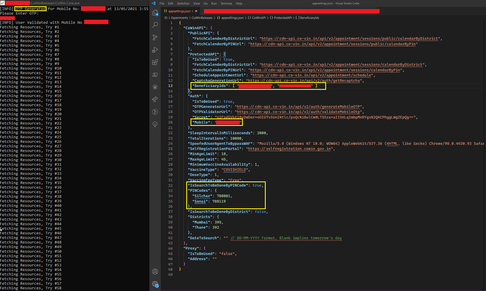

*Application Start - OTP Generation*

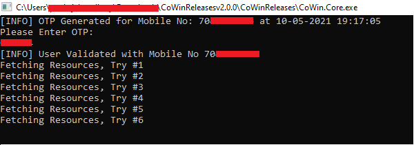

*Application Start - OTP Validated - BearerToken Generation*

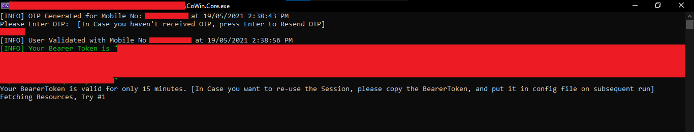

*Application OTP Retrigger In Case OTP is not received within time. Press `Enter` to Retrigger OTP*

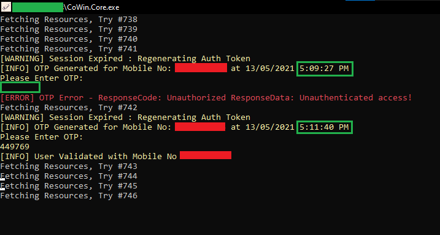

*Application Slot Booking - Captcha Input*
 
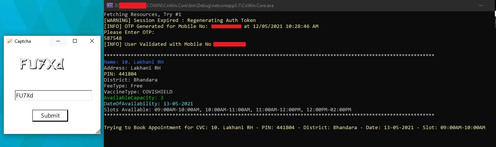

*Application Slot Booking - Manual Captcha Input*
 
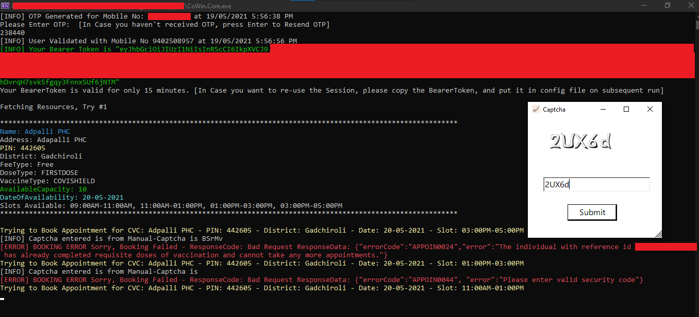

*Application Slot Booking - AI Assisted AutoCaptcha Feature*
 
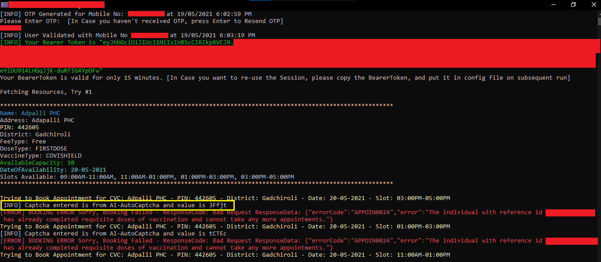

*Application Slot Booking - Using Bearer Token for Session Resuse with Manual Captcha*
 
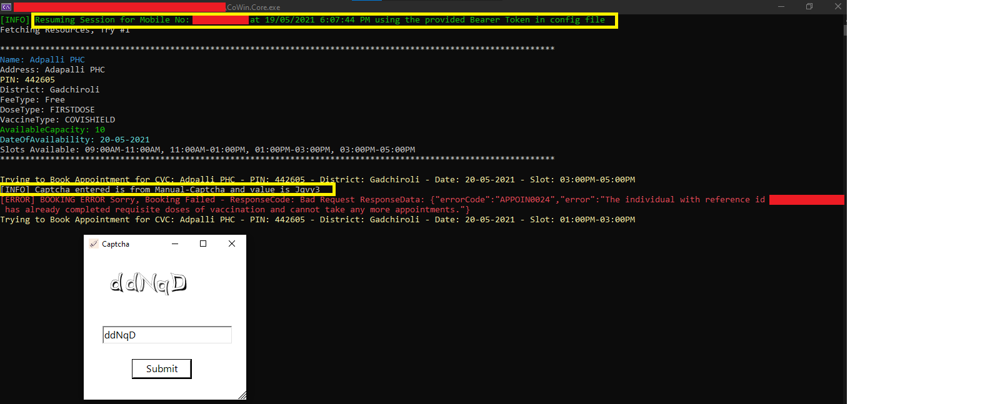
 
*Successful Booking Scenario*

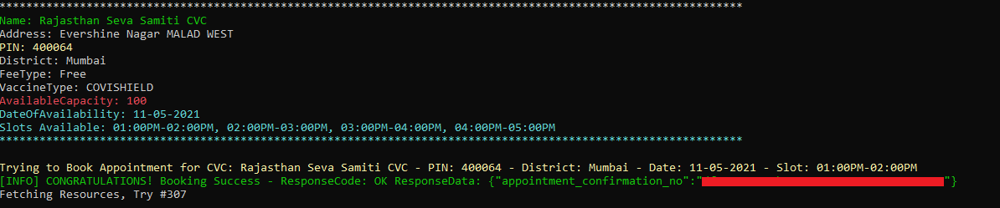

*Unsuccessful Booking - All Slots Full*

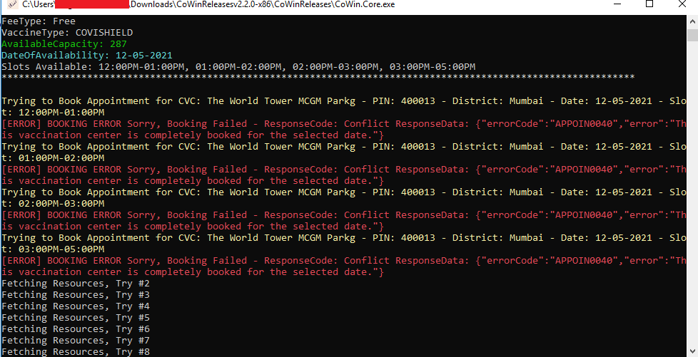

*Unsuccessful Booking - Beneficiary Details Incorrect*

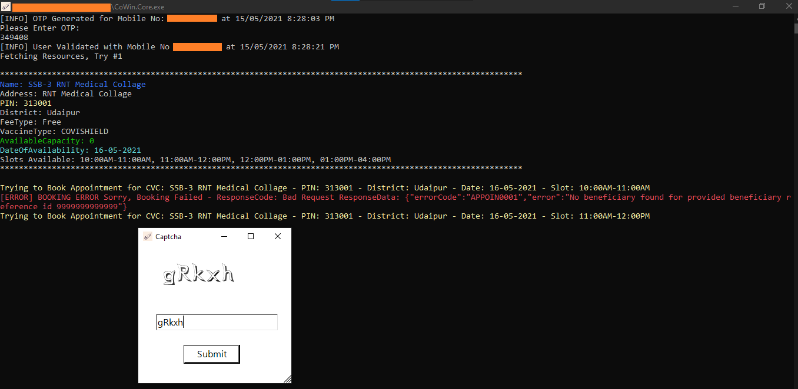

*Unsuccessful Booking - Server Under Heavy Load*

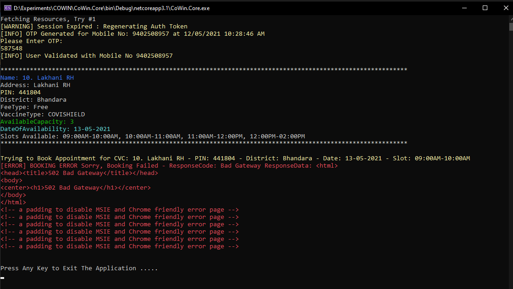

*Application Session Regeneration on TimeOut* 

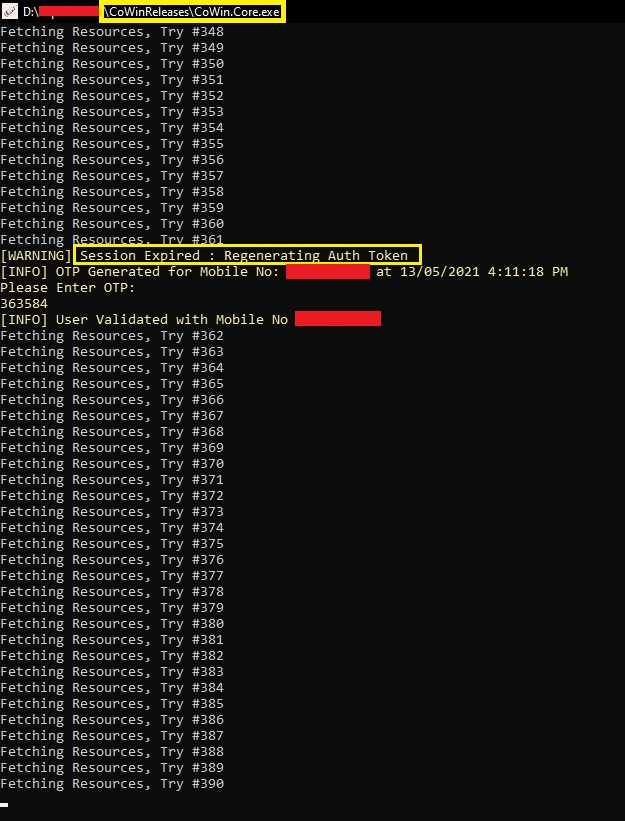

*Application OTP Validity Expired (`Expiry Time 3 Minutes from Generation`) when user enter the OTP for validation*

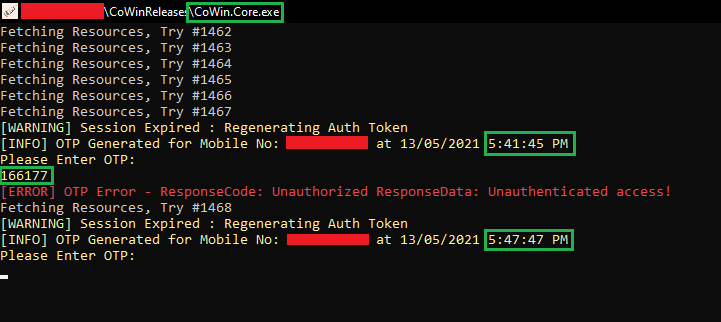

#### PRO TIP

> *When the Captcha pops up in the process of booking, DO NOT use your mouse to click on the Popup, you can start typing it immediately as the app would remain ready to accept your input. Once captcha is entered, then press Enter to submit. This way, it is faster than operating via Mouse, as every second matters! In case, you are unable to get your booking successful in first try, when subsequent captch pops up, you will NOT need to use your mouse and click on Popup, you can right away start typing the 5 captcha characters and press Enter! Boom, it'll work*

Enjoy and feel free to Star the Repo, if it could help you in any way! Also, feel free to share screenshot (after hiding personal information) as a New `Pull Request` in the /data/ folder or a `New Issue` in case you could successfully book through the App. Also share your feedback through issues or just comment/share/like in the associated [LinkedIn Post](https://www.linkedin.com/feed/update/urn:li:activity:6796093424492720128/). That'll be used as References/Testimonials in the Application and will increase the credibility of the App.

<a href="https://www.buymeacoffee.com/srvsaha" target="_blank"></a>

### DISCLAIMER

### Important: 
- This is a proof of concept project. I do NOT endorse or condone, in any shape or form, automating any monitoring/booking tasks. **Developed for Educational Purpose; Use at your own risk. I SHOULD NOT BE DEEMED RESPONSIBLE FOR ANY LEGAL CONCERNS.**
- This CANNOT book slots automatically. It doesn't skip any of the steps that a normal user would have to take on the official portal. You will still have to enter the OTP and Captcha. This just helps to do it from Console rather than through Official WebApps/Apps.
- Do NOT use unless all the beneficiaries selected are supposed to get the same vaccine and dose. 
- When multiple beneficiaries are added for a single registered mobile number, all beneficiaries will get the Same Dose, Same Vaccine, Same Centre and Same Slot. In case any of this doesn't meet the requirements, booking might not be successful. 
- While selecting beneficiaries, make sure that selected beneficiaries are all taking the same dose: either first OR second.
  Please do no try to club together booking for first dose for one beneficiary and second dose for another beneficiary.
- While selecting beneficiaries, also make sure that beneficiaries selected for second dose are all taking the same vaccine: COVISHIELD OR COVAXIN.
  Please do no try to club together booking for beneficiary taking COVISHIELD with beneficiary taking COVAXIN.
- If you're selecting multiple beneficiaries, make sure all are of the same age group (45+ or 18+) as defined by the govt.
  Please do not try to club together booking for younger and older beneficiaries.
- AUTO BOOKING is ON by default, so it books the slot after you enter a valid captcha for the Slot which is displayed. So, if you feel you want some particular vaccination centre(s), make sure you are searching by PIN Code for the particular Vaccination Centre(s). In case, you don't want to book the slot, you might simply close the Captcha Popup, and the App will try further to book the next available slots in First-Come-First-Serve Basis.
- If you accidentally book a slot, don't worry. You can always login to the [Official portal](https://selfregistration.cowin.gov.in/) and cancel or re-schedule the booking. There is no option for reschedule or cancel of Booking of Slot available in the Application.
- There is no option to register new mobile or add beneficiaries. This can be used only after beneficiary has been added through the Official WebApp of [CoWIN](https://cowin.gov.in/) or [Aarogya Setu](https://www.aarogyasetu.gov.in/)


## Application Features

Following are some of the main features of the App:

- [x] OTP Generation/Validation
- [x] Search by Either PINCode or District or Both PINCode and District with preference to PINCode for better Searching
- [x] Auto Retry To Fetch Slots Every 2 Seconds
- [x] BEEP BEEP User Notifier On Slot Availability To Book the Available Slot
- [x] OTP Notifier for New Session & On Timeout
- [x] Captcha Popup Entry for Booking Slot
- [x] Booking for Multiple Beneficiaries linked to a Registered Mobile Number 
- [x] OTP Regeneration/Validation on Timeout/Session Expiry 
- [x] Zero Setup Application, Just Download and Run! Easy to Use!
- [x] No specialized Software required for modification of Config file
- [x] Allow Any Vaccine Type and Any Fee Type for Booking Slots; Remove Mandatory Filters on VaccineType and FeeType
- [ ] Verbose Mode to be Developed so that user can check each and every step as what is going on behind the scenes when slots are being fetched & processed
- [ ] Application Latest Version Check Automatically before proceeding
- [ ] Integration of Notification Engine with Telegram Bot/Mail Service/Webhook Endpoint
- [ ] Addition of Automated Tests, CI/CD Pipeline, Auto increment of version
- [ ] Debug Mode to be Developed to trace any bug/issue reported in User's Machine while running the Application
- [ ] Telemetry Metadata of Booking for Updating Statistics to see how the App is helping others. No Personal Information to be taken.
- [ ] Auto Notifier/Auto OTP Reading functionality to be added for seamless flow
 
## Technical Details

It's a simple hybrid Console + WinForms Application being developed using .NET Core 3.1, WinForms and C#.

_**Currently, application is bundled as a Single Standalone Executable EXE file with Runtime included and therefore no installations are needed to run the Application. However, it will only work on Windows Machines only, due to dependency on WinForms for Captcha Popup**_

In General, to run the application, the following things are needed:
- Windows 7 SP2 or higher where .NET Core 3.1 Runtime is supported, that's it. 

> [.NET Core 3.1 Runtime](https://dotnet.microsoft.com/download/dotnet/3.1/runtime) is bundled in the Release so no other external dependencies to run the Application.
  _FOR DEVELOPERS TO BUILD/MODIFY_ [.NET Core 3.1 SDK](https://dotnet.microsoft.com/download/dotnet/thank-you/sdk-3.1.408-windows-x64-installer) is required to build from Source Code or to make some customizations. Use of [Visual Studio 2019](https://visualstudio.microsoft.com/downloads/) is recommended for the purpose of development. 

Currently, searching using the [calenderByDistrict API](https://apisetu.gov.in/public/marketplace/api/cowin/cowin-public-v2#/Appointment%20Availability%20APIs/calendarByDistrict) and [calendarByPin API](https://apisetu.gov.in/public/marketplace/api/cowin/cowin-protected-v2#/Vaccination%20Appointment%20APIs/calendarByPin) are integrated to get all the available slots in a particular district/PINCode and to book the slot on First-Come-First-Serve Basis, the
 [appointmentSchedule API](https://apisetu.gov.in/public/marketplace/api/cowin/cowin-protected-v2#/Vaccination%20Appointment%20APIs/schedule) is used.
 
We have got endpoints of both the Public and Protected APIs from APISetu, but a general observation was the Public APIs return stale data as caching is done for around 30 minutes and there is API throttling of 100 requests/5 minutes from 1 IP Address.

Since the slots are gone literally in seconds, so I had to use the Protected APIs for the application.

Well, what's probably going on in your mind is, how do I get the Authentication Information to call the Protected APIs?

We're generating the OTP and then Validating it using the same method as CoWIN App.

On validation of OTP, we get the AuthToken which is further used for the Authentication Purpose.

Rest of the stuff are self-explanatory.

## How to Use:

### For Folks who just want to get shit done

- Get the Latest Release of the Software either by [clicking here](https://github.com/SRvSaha/CoWinVaccineSlotFinder/releases/latest) or from Releases Section
- Download the ZIP file of the Latest release for your Operating System
- Extract the ZIP file, you'll find two file like this:
  
 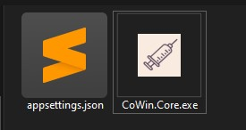
 
- Modify the settings inside `appsettings.json`
- Double Click `CoWin.Core.exe` to RUN the Application.

### How to Open appsettings.json

In layman terms, it is just like any other text file which can be opened in any text editor like Notepad, Wordpad, VS Code, Sublime Text, Notepad++ etc.
Modification can be done and file to be saved again with the same name and File Types as "All Files"

### How to Get User Specific Information for appsettings.json

1. Go to `cowin.gov.in`
2. Generate OTP for your registered mobile number. You need to provide this mobile number in the `appsettings.json` file.
3. Validate the OTP
4. After you are logged in, you'll see a dashboard like this, get the highlighted number REF ID, which is your beneficary ID and would be required in your `appsettings.json`. If you have multiple members added in your registered mobile number, you will get multiple REF IDs. Use the REF IDs for which you want to do booking

  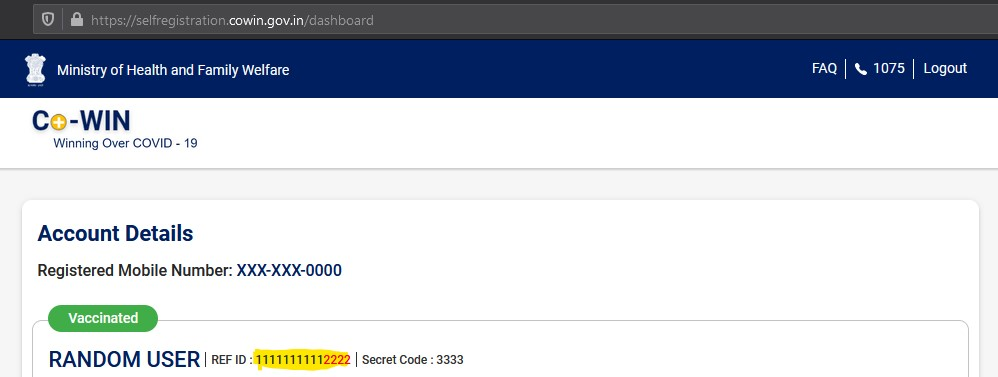

5. Also, Once all these details are fetched, put them in the `appsettings.json`. 
6. Run the Application CoWin.Core.EXE, that's it.

## Configuration Changes

### _**The values of the following items MUST BE MODIFIED in `appsettings.json`**_

``` javascript
"BeneficiaryIds": [ "REPLACE_WITH_YOUR_BENEFICIARY_ID_1", "REPLACE_WITH_YOUR_BENEFICIARY_ID_2" ] 
// You'll get the beneficiary ID from Step 4 above. 
// If you have only 1 beneficiary ID then Use it in the <REPLACE_WITH_YOUR_BENEFICIARY_ID_1> section and remove rest like "REPLACE_WITH_YOUR_BENEFICIARY_ID_2" eg. ["1111111111111111"]. 
// If you have multiple beneficiaries for which you want to do booking, added them comma separated eg. ["11111111111111", "22222222222222", "33333333333333"]
"Mobile": "REPLACE_WITH_YOUR_REGISTERED_MOBILE_NO", 
// Use your registered mobile number used for generation of OTP in Step 2 above.
// Use it in the REPLACE_WITH_YOUR_REGISTERED_MOBILE_NO section. Suppose your Mobile Number is 8888333388 then it'll be like "Mobile" : "8888333388". 
// *NOTE* Don't use +91 infront of your mobile number, use only 10 digit mobile number
"DoseType":  "<REPLACE_ME>", // Use either 1 OR 2 Depending on 1st DOSE or 2nd DOSE in the <REPLACE_ME> section, by default 1 is selected for 1st Dose
"PINCodes": [
  "REPLACE_ME_WITH_YOUR_PIN_CODE_1",
  "REPLACE_ME_WITH_YOUR_PIN_CODE_2"
]
// You can use anything in PlaceName, PINCode is to be the PIN you wish to search for, as of now things are done for Mumbai and nearby areas. 
// If you want to search say for a particular PIN Code of Mumbai let's say 400008 then the entry would look like this : "PINCodes": [ "400008" ].
// Basically, Replace REPLACE_ME_WITH_YOUR_PIN_CODE_1 WITH 400008. and remove everything else.
// In case you want to search for multiple PIN Codes say 400008 and 400007, 
// you'll have to remove REPLACE_ME_WITH_YOUR_PIN_CODE_1 with 400008 and REPLACE_ME_WITH_YOUR_PIN_CODE_2 with 40007 and so in, it would look something like this "PINCodes": [ "400008", "400007" ]

```

### _**The values of the following items MAY BE MODIFIED in `appsettings.json`, default values are set**_

``` javascript
"VaccineType": "<REPLACE_ME>", // USE EITHER COVAXIN OR COVISHIELD, OR SPUTNIK V or "" in the <REPLACE_ME> section, by default "" is selected with means both
"VaccineFeeType": "<REPLACE_ME>", // USE Either Free or Paid or "" in the <REPLACE_ME> section, by default "Free" is selected, blank implies both Free and Paid
"VaccinationCentreName": "<REPLACE_ME>", // Use Name of Vaccination Centre or "" in the <REPLACE_ME> section, by default Blank would be selected which implies All Vaccination Centres in the District/PINCodes.
"IsSearchToBeDoneByPINCode": "<REPLACE_ME>", // Use Either true or false in the <REPLACE_ME> section where True means searching is done using PIN Code, by default true is selected. Set this is True if you want to search By PIN Code
"DateToSearch": "<REPLACE_ME>",  // Use date in DD-MM-YYYY Format in the <REPLACE_ME> section, Blank implies date of next day (i.e, tomorrow), by default "" is selected to search for Next Day
"IsSearchToBeDoneByDistrict": "<REPLACE_ME>", // Use Either true or false in the <REPLACE_ME> section where True means searching is done by DistrictId, by default false is selected, Set this is True if you want to search By District
"Districts": [
  "REPLACE_ME_WITH_YOUR_DISTRICT_CODE_1",
  "REPLACE_ME_WITH_YOUR_DISTRICT_CODE_2"
],
// You'll get the District Name and District Codes from the link below this block, as of now things are done for Mumbai and nearby districts. 
// Basically, Replace REPLACE_ME_WITH_YOUR_DISTRICT_CODE_1 with 395, then the entry would look like this : "Districts": [ "395" ].
// In case you want to search for multiple Districts say Mumbai and Thane, get the District-District Code Mapping from below "State-District-DistrictCode Mapping", // you'll get the DistrictCode of Mumbai as 395 and of Thane as 392.
// You'll have to remove REPLACE_ME_WITH_YOUR_DISTRICT_CODE_1 with 395 and REPLACE_ME_WITH_YOUR_DISTRICT_CODE_2 with 392, it would look something like this "Districts": [ "395", "392"]
"Proxy": 
{
   "IsToBeUsed": "<REPLACE_ME>", // Use true or false, true if you are behind Proxy Server, False if you're not, in the <REPLACE_ME> section, by default false would be selected
   "Address": "<REPLACE_ME>" // Use the THE PROXY ADDRESS IF YOU ARE BEHIND PROXY SERVER (usually in Office/Corporate Network) in the <REPLACE_ME> Section, by default this will be blank
}
```

*You can get the District Name and District Code Mapping from [State-District-DistrictCode Mapping](data/resources/State_District_DistrictCode_Mapping.json). Just copy the values of the `DistrictCode` from the file and paste it in the `appsettings.json` file's {"Districts"}* Or, you can refer the readable [State-District-DistrictCode Markdown](data/resources/State_District_DistrictCode_Mapping.md) file and get the values of District Codes from there.

Entries in the [State-District-DistrictCode Mapping](data/resources/State_District_DistrictCode_Mapping.json) file would be like below. In this case, the DistrictCode will 3, 1 and 2.

```javascript 
  "Andaman and Nicobar Islands": {
    "Nicobar": 3,
    "North and Middle Andaman": 1,
    "South Andaman": 2
  }
``` 

Be default, this is how the `appsettings.json` would look like this:
``` javascript
{
  "CoWinAPI": {
    "PublicAPI": {
      "FetchCalenderByDistrictUrl": "https://cdn-api.co-vin.in/api/v2/appointment/sessions/public/calendarByDistrict",
      "FetchCalenderByPINUrl": "https://cdn-api.co-vin.in/api/v2/appointment/sessions/public/calendarByPin"
    },
    "ProtectedAPI": {
      "IsToBeUsed": true,
      "FetchCalenderByDistrictUrl": "https://cdn-api.co-vin.in/api/v2/appointment/sessions/calendarByDistrict",
      "FetchCalenderByPINUrl": "https://cdn-api.co-vin.in/api/v2/appointment/sessions/calendarByPin",
      "ScheduleAppointmentUrl": "https://cdn-api.co-vin.in/api/v2/appointment/schedule",
      "CaptchaGenerationUrl": "https://cdn-api.co-vin.in/api/v2/auth/getRecaptcha",
      "BeneficiaryIds": [ "REPLACE_WITH_YOUR_BENEFICIARY_ID_1", "REPLACE_WITH_YOUR_BENEFICIARY_ID_2" ]
    },
    "Auth": {
      "IsToBeUsed": true,
      "OTPGeneratorUrl": "https://cdn-api.co-vin.in/api/v2/auth/generateMobileOTP",
      "OTPValidatorUrl": "https://cdn-api.co-vin.in/api/v2/auth/validateMobileOtp",
      "Secret": "U2FsdGVkX18vDwDor+oOIG7vSUnINtlc/pxQcNiBulCm8LT5Sza+aIISKLqImbpMnRYgsN2QACPhggLWgZEpQg==",
      "Mobile": "REPLACE_WITH_YOUR_REGISTERED_MOBILE_NO"
    },
    "SleepIntervalInMilliseconds": 2000,
    "TotalIterations": 10000,
    "SpoofedUserAgentToBypassWAF": "Mozilla/5.0 (Windows NT 10.0; WOW64) AppleWebKit/537.36 (KHTML, like Gecko) Chrome/90.0.4430.93 Safari/537.36",
    "SelfRegistrationPortal": "https://selfregistration.cowin.gov.in",
    "MinAgeLimit": 18,
    "MaxAgeLimit": 45,
    "MinimumVaccineAvailability": 1,
    "VaccineType": "", // Blank Implies Any VaccineType: "COVISHIELD" OR "COVAXIN" OR "SPUTNIK V"; Default is any types of Vaccine
    "DoseType": 1, // FirstDose => 1, SecondDose => 2
    "VaccineFeeType": "Free", // Blank Implies Any VaccineFeeType: Free or Paid; Default is Free
    "VaccinationCentreName": "", // Blank implies All Vaccination Centres in the District/PINCodes, which is default
    "IsSearchToBeDoneByPINCode": true, // Set this as True if you want to set by PINCode
    "PINCodes": [
      "REPLACE_ME_WITH_YOUR_PIN_CODE_1",
      "REPLACE_ME_WITH_YOUR_PIN_CODE_2"
    ],
    "IsSearchToBeDoneByDistrict": false, // Set this is True if you want to search By District
    "Districts": [
      "REPLACE_ME_WITH_YOUR_DISTRICT_CODE_1",
      "REPLACE_ME_WITH_YOUR_DISTRICT_CODE_2"
    ],
    "DateToSearch": "" // DD-MM-YYYY Format, Blank implies tomorrow's day; Date Searched is upto 7 days from the date in DateToSearch
  },
  "Proxy": {
    "IsToBeUsed": "false",
    "Address": ""
  }
}

```

As simple as that!

Enjoy and feel free to Star the Repo, if it could help you in any way!

### For Developers or Curious Minds:

If you have Visual Studio installed, go ahead an Clone the Repository, Open the SLN file, Make changes in  `appsettings.json`, Ctrl + F5 and Boom!

Well, want to dig deeper?

So basically, you've this Project Named `CoWin.Core` which contains `appsettings.json` which performs most of the magic.
`CoWin.UI` is just a small project for handling the Captcha. `CoWin.Tests` is used for Automated Unit Tests.

Rest of the Business Logic are there inside the  `/Models` directory. Authentication & Authorization stuffs can be found in `/Auth` directory. API consumption stuffs can be found in `/Providers` directory.
Application begins from `Program.cs` from the `CoWin.Core` project.

> Clean Coding Practices have been followed during the development of the Application within a span of 2 days after Office Hours. So, you won't find proper Exception Handling, using Dependency Injection or Logging or even Documentation, duh!

I know, I know, it's unacceptable, but folks, it's all about quick Time to Market first and then doing one thing at a time, to improve the product. 

I'll be more than happy to have PRs with modifications.

If you'd like to do it the hard way, clone it, build it and run it. Make sure you've the dependencies required to run the Application as mentioned in [Technical Details Section](#technical-details)


> **NB:** appsettings.json play the major role for accessing and booking and filtration of searches. Fiddle with it! Appologies that the Code doesn't have inline documentation, but code is readable and self explanatory. In case of any suggestions or bugs or feature request, feel free to raise an Issue.

Cheers!
